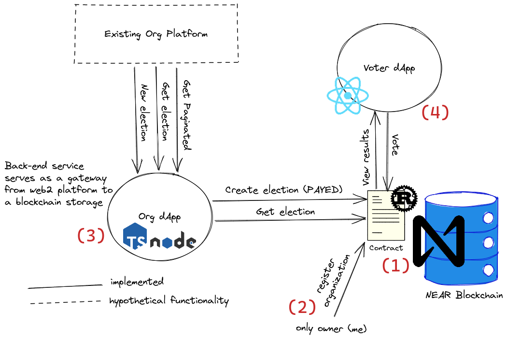

# Open Elections Platform

This is [NCD](https://www.near.university/courses/near-certified-developer) demo project. No production use intended.

## Overview

The goal is to utilize public blockchain for voting on some organizational decisions.

The clients of the platform are web2 organizations that want to add public voting for their new products/features/ideas etc.

### Diagram


[Excalidraw](https://excalidraw.com/) used to draw diagram. [Diagram source](./diagram.excalidraw) is checked-in as well.

System has 4 main parts:

1. Elections contract that is deployed to NEAR blockchain
2. Owner of the contract, who:
    * registers new organizations
    * builds dApps per their requirements
    * receives well-deserved money from organizations
3. REST-like Gateway dApp. 
    * entry point for organization's services
    * creates new elections on behalf of the organization
4. Voter front-end dApp. Usual React app for actual voters.

## Deployment

Steps to run both apps locally:

1. Deploy contract & register organization (see [readme](./contract/))
2. Start up gateway (see [readme](./gateway/))
3. Start up front-end (see [readme](./voter-dapp/))

Or use provided start-up script to deploy to testnet. Script requires:
* `near` executable 
* `MASTER_ACCOUNT` env variable.
* `jq` executable
```shell
MASTER_ACCOUNT="vchernetskyi.testnet" ./start.sh
```

## Usage

Create elections through gateway:
```shell
curl \
    -H "Content-Type: application/json" \
    -d "$(python contract/scripts/generate_election.py)" \
    http://localhost:8080/elections
```

Visit http://localhost:3000 in your browser view elections and vote there.
